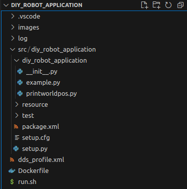
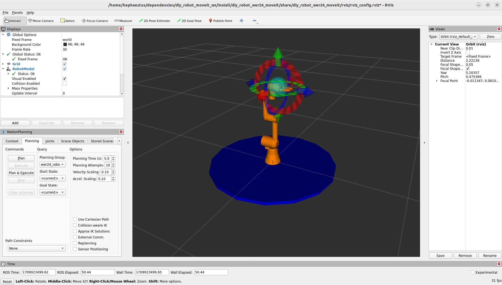

# diy_robot_application

## thematical Classification

This is the final Readme of our whole series documenting the ROS-Integration for our 6 axis DIY-robot (designed by LOBOCNC) with our parallel gripper.
All the other repos you should have looked at before using the software provided inside of this repo are included here as dependencies inside of this docker container and make the whole ROS-integration work.
For a general overwiew please refer to the main ROS-repo of our project: https://github.com/mathias31415/diy_robotics/tree/main/ROS-Packages

It's also highly recommended to read the other linked package-repos to understand how ROS is working and how you affect ROS when you program your own robotics application inside this package.

For clarity reasons al the needed dependencies are not located inside your main ROS-workspace. This graphic was shown in the main repo already, but it explains the structure inside the docker container you will use inside this tutorial very well:


Due to this structure you have the opportunity to launch all the mentioned launch files in the other repos. But this is only for validation and testing purposes and not recommendet for beginners. If you are intrested please refer to the other repo readmes.

## Package Structure



This package has the build type ````ament_python```` so it allows you to program in Python and execute these scripts from the command line of your terminal.
It contains the following folders/ files:

- images and README.md are only for documentation purposes
- log, run.sh, Dockerfile and dds_profile.xml handle the build of your docker container the whole ROS-integration is running in.
- resource, test, setup.cfg and package.xml were autogenerated when we creted the application package and not recommendet to modify
- src/diy_robot_application: this is the folder conteining the applications itself
- setup.py: this was also autogenerated when we created the package but you need to modify this file as mentioned below to enter your applications from the command line

This package is designed as an development-package. We will work with the ````src```` folder on our dev-machine mounted directly to the container. This gives you the opportunity to develop your applications on your dev-machine (for example with VS-Code) and execute them inside od the conteiner withour re-building it.
We will come back later to this point.

## HowTo: Your first robot application:

### Set up the Workspace:
1) download/ clone this repo to your dev-machine
2) open VS-Code or any other IDE and add the ````src```` folder to your workspace
3) open a terimial (Terminator ist highly recommended)
4) navigate to the folder you cloned the repo in from step 1 (using cd <path> and ls to view content)
5) build the container by sourcing the run-script ````./run.sh```` Note: working wifi connection is required because the dependencie packages will now be cloned directly in your container from GitHub.

Now you should be inside your docker container at your working workspace ````hephaestus@§USER:~/ros2_ws$ ````


### Set up the Application in Simulation (use_fake_hardware:=true) and execute the provided example.py:
1) build your workspace inside of the container ````colcon build````
2) source your workspace ````source install/setup.bash````
3) launch all required nodes to make the whole integration work by typing the following line in your terminal ````ros2 launch diy_robot_wer24_moveit complete.launch.py````
   In this case we don't pass launch arguments because we want to use the defaults.

Now the Rviz window with MoveIt included should have started:



Now you can move the robot arond and perform motion planning tasks by pressing the Plan& Execute button on the lower lefthand side.
Feel free to try all functionalities Rviz already provides.

4) open another terminal (when you use terminator you can just press Ctrl + Shift + e)
5) connect the new terminal to the one already running with ````docker ecex -it diy_robot_application bash````
6) switch back to VS-Code on your dev-machine and open your application file, for example ````example.py````
7) make sure that the argument ```robot = RobotClient(is_simulation=True)``` is passed when you work with fake hardware (if this is not passed MoveIt trys to connect to the gripper hardware and fails)
8) make sure the code you want to execute is placed inside the main-loop
9) switch back to the docker container (second terminal)
10) build and source your workspace
11) execute the example.py by typing the following line in your terminal ````ros2 run diy_robot_application example````

Now you should see the robot move in Rviz (Note: gripper movements will not be displayed for simplicity reasons)

### Set up the Application with the real Hardware (use_fake_hardware:=false) and execute the provided example.py:
1) build your workspace inside of the container ````colcon build````
2) source your workspace ````source install/setup.bash````
3) connect your dev-machine to the network shared with your robotics hardware (we recommend to open a lokal hotspot with your mobile phone and name it "DIY-ROBOTICS")
4) open the provided ESP32 code in a seeprate VS-code window (PlatformIO extention needed) and change in the gripper and arm ````Cofiguration.h```` the needed network parameters
5) upload the modified code on the gripper ESP and arm ESP
6) make sure the robot is in it`s home position (because we have no joint angle sensors on our hardware we need this pose as a common starting point in between the hardware and the digital twin)
7) power on the robot and wait until the ESP's are connedćted to the shared network
8) launch all required nodes to make the whole integration work by typing the following line in your terminal <br> ````ros2 launch diy_robot_wer24_moveit complete.launch.py use_fake_hardware:=false robot_ip:=<your arm ip> gripper_ip:= <your gripper ip>```` <br>
   In this case we have to pass at least the mentioned launch arguments.

Now the Rviz window with MoveIt included should have started and the displays on the hardware side should visualize that a connection is established sucessfully.
You should recognize this log-message in the terminal you started the launch file too: <br> ````[ros2_control_node-1] [INFO] [1708697874.866430796] [ESP32_Driver]: Successfully connected to the Robot via TCP-IP! ````


Now you can move the robot arond and perform motion planning tasks by pressing the Plan& Execute button on the lower lefthand side.
Feel free to try all functionalities Rviz already provides.

In addition to that you can now start our ````example.py```` application in the same way as you have done with fake hardware.
But make sure that the argument ```robot = RobotClient(is_simulation=False)``` is passed. If not, the application won't connect to the gripper driver.

Now you should see the robot move in Rviz (Note: gripper movements will not be displayed for simplicity reasons) and for sure the real robot should move the same way.

### Write your own Application File:
At this point in our tutorial you should be familiar with all the methods implemented in the ````example.py```` application file, because now you can build up your own robotics application (for example a simple pick and place routine) by combining these methods.

Please follow this workflow to create your own application:
1) switch to VS-code
2) create an new python file inside the ````src/diy_robot_application```` folder and name it with your application name
3) paste this template into the new empty file:

```python
import rclpy
from ros_environment.scene import RobotClient
from manipulation_tasks.transform import Affine #for 6D transformation 
import numpy as np
import time

def main(args=None):
    # initialize ros communications for a given context 
    rclpy.init(args=args)

    # initialize robot client node --> this will create clients in the RobotConnection class which call services to communicate with moveit
    robot = RobotClient(is_simulation=False)     # if not connected to the real robot set is_simulation=True 
    
    # move robot to home position (use default [0.0, 0.0, 0.0, 0.0, 0.0, 0.0])
    robot.home()

    #
    #
    # define your own robot motion scedule here by using the methods explained in the example.py file
    #
    #

    # destroy the robot node, stop execution
    robot.destroy_node()

    # shutdown previously initialized context
    rclpy.shutdown()
```

4) switch in VS-code to the ````setup.py```` file inside your workspace
5) add your application to the ROS-entrypoints as shown below to access them <br> with the ````ros2 run diy_robot_application <application name````:

```python
    #define here executables you want to call from the commamnd line. This are usual your applications
    entry_points={                                                     
        'console_scripts': [                        
            'example = diy_robot_application.example:main',
            'printworldpos = diy_robot_application.printworldpos:main',
            'your_application = diy_robot_application.your_application:main'   
        ],
    },
```
6) switch back to the container (terminal you opened secondly), re-build and source the workspace and run the application as mentioned above.

Now your robot should perform the application you have written currently.

## Conclusion
We hope you enjoyed this whole readme series trying to explain how to integrate a custom robotics hardware in the ROS-framework.

By changing or modifying some of the dependencies packages you can easily adapt this integration to any other hardware.


